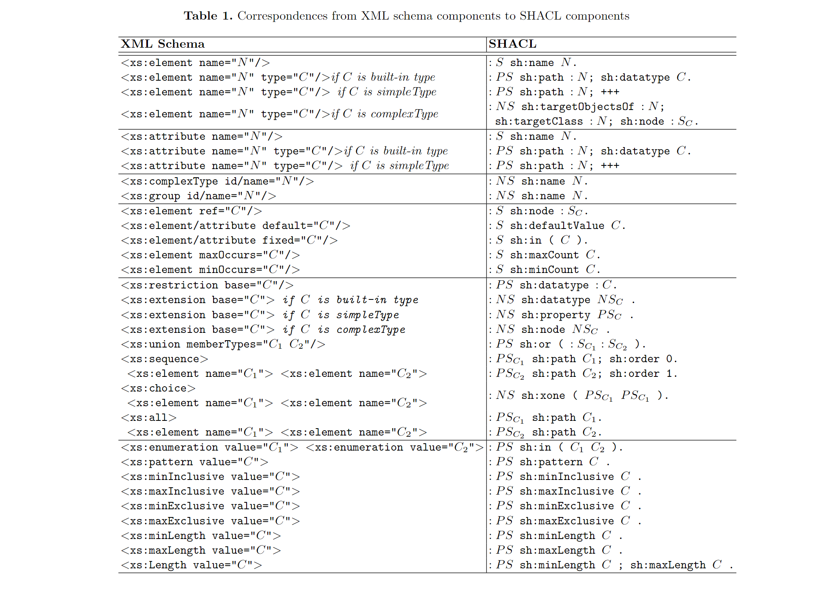

# XSD2SHACL

See translation and implementation detail in report.

## Prerequisite

Install the required dependencies:

```
$ pip install -r requirements.txt
```

## Usage

To translate XML Schema to SHACL shapes:

```
$ python XSDtoSHACL.py XSD_FILE
```

For example, if you execute the following:

```
$ python XSDtoSHACL.py testcase/example.xml
```

The generated shape file will then be located here: testcase/example.xml.shape.ttl

## Translation correspondences:

<div align="center">
  
</div>


## To Do

- [ ] attribute language
- [ ] fix element without type
- [ ] Evaluation 


