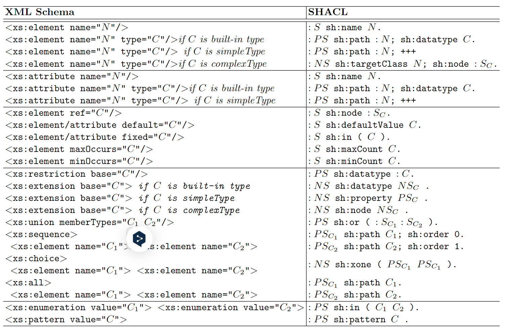
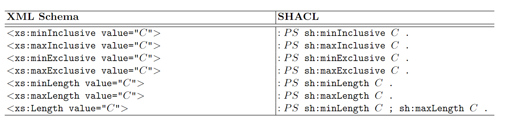

# XSD2SHACL

See translation and implementation detail in this report: 

## Prerequisite

Install the required dependencies:

```
$ pip install -r requirements.txt
```

## Usage

To translate XML Schema to SHACL shapes:

```
$ python XSDtoSHACL.py XSD_FILE
```

## Translation correspondences:

<div align="center">
  
</div>

<div align="center">
  
</div>

## To Do

[] choice
[] fix issue: extension => emueneration.xml and sequence.xml 
[] Evaluation 


